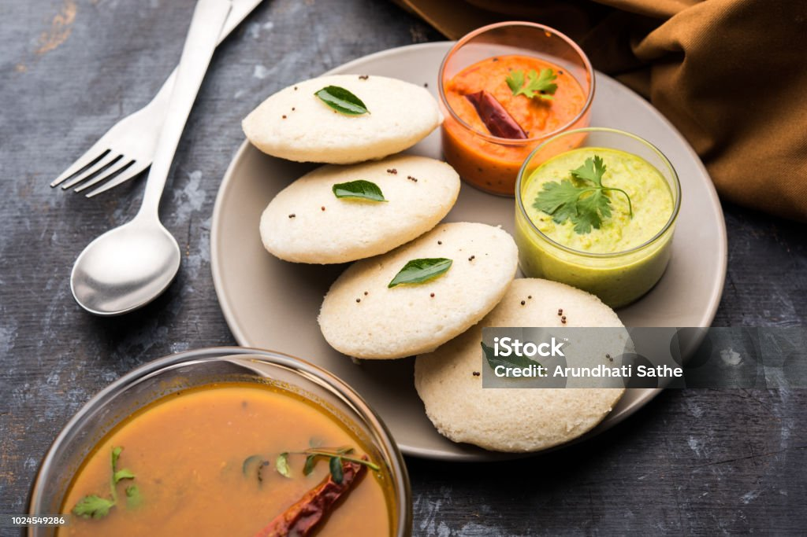

# Anushka Uppula

###### My favorite Food - Idli

Idli is a traditional South Indian dish known for its light, fluffy texture and mild flavor. It consists of steamed rice cakes made from a fermented batter of rice and urad dal (black gram). The fermentation process not only enhances the idli's taste but also makes it easily digestible and rich in beneficial bacteria.

Here is a picture of Idli

 Often enjoyed as a breakfast item or as part of a meal, idlis are typically served with an array of accompaniments, including coconut chutney, sambar (a spicy lentil stew), and various other side dishes. This versatile and nutritious dish is beloved for its simplicity, health benefits, and its role in Indian culinary culture.

 ---

###### Recommended Restaurants for Idli

If you're looking to enjoy delicious idlis, here are some highly recommended restaurants and food vendors known for their exceptional idli preparations. Each establishment offers a unique take on this beloved South Indian delicacy, ensuring you have a memorable dining experience.

| Restaurant Name | Recommendation Reason        | Location     |
|-----------------|----------------------------------------------------|-------------------------|
| Saravana Bhavan | Famous for its authentic and fluffy idlis.         | Chennai, Tamil Nadu     |
| MTR             | Known for its traditional recipe and consistent quality. | Bangalore, Karnataka    |
| Annapurna       | Offers a variety of idlis with unique accompaniments. | Hyderabad, Telangana    |
| Udupi Krishna   | Renowned for its delicious idlis and quick service. | Mumbai, Maharashtra     |

---

###### Favorite Quotes

Here are a couple of jokes that always bring a smile:

> "I am on a seafood diet. I see food and I eat it."  
> _Anonymous_

> "A day without sunshine is like, you know, night."  
> _Steve Martin_